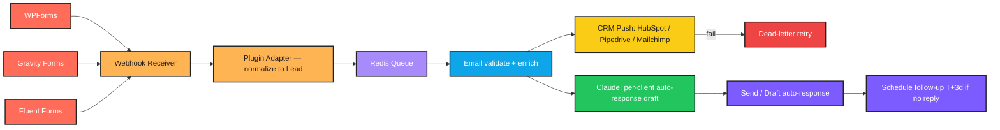

# CLAUDE.md — Universal Agent — WordPress, Forms, CRMs, Email

> **Language:** Python (3.10+)
> **Client:** Ryan B., Operations Lead — Vertex Web Studio
> **Budget:** $5,000–9,000 | **Timeline:** 3–4 weeks

---

## 1. Project Overview

Most of Vertex's clients have **WordPress sites** with WPForms or Gravity Forms, connected to a CRM (HubSpot, Pipedrive, or Mailchimp), sending emails via Gmail or G Suite. **Every new client has the same patchwork of integrations and the same gaps** — leads missed, follow-ups dropped, data not synced.

We are building a **single agent platform** that Vertex can deploy to any new client, that connects:

```
WordPress forms → CRM → Email
```

…and **adds intelligence on top**: smart routing, smart replies, smart follow-ups. **One codebase, configurable per client.**

---

## 2. Required Features

| # | Feature | Notes |
|---|---------|-------|
| 1 | Receives webhook from WPForms, Gravity Forms, or Fluent Forms | Multiple form plugins |
| 2 | Enriches lead data via web research and email validation | Light enrichment |
| 3 | Pushes to client's CRM (HubSpot, Pipedrive, or Mailchimp) | With full context |
| 4 | Drafts personalized auto-response email tailored to form content | Not a generic template |
| 5 | Triggers a follow-up sequence if no reply within 3 days | Configurable |
| 6 | Per-client config file | Change tone, CRM, email templates, routing rules |
| 7 | Admin dashboard showing all leads, status, and what the agent did with each | Per-client view |
| 8 | Webhook-based — can deploy to a new client site in under an hour | Fast onboarding |

---

## 3. Important Constraints

- **Auto-response emails must be tuned per client tone** — no generic template.
- **Must work even when client uses different form plugins on different sites.** Plugin abstraction layer required.
- **Failure-tolerant** — if CRM is temporarily down, queue the lead and retry. Never lose a lead.
- **Every action logged with full audit trail.**
- **No hardcoded client data** — everything lives in config files we can swap.

---

## 4. Tech Stack

```
Python 3.10+    |   FastAPI              |   Webhooks
WordPress REST API     |   HubSpot / Pipedrive / Mailchimp APIs
Gmail API       |   Claude API           |   Redis (queueing)
```

---

## 5. Architecture

```
   ┌─────────────────────────────────────────────────────────┐
   │            WORDPRESS SITE (per client)                   │
   │   WPForms / Gravity Forms / Fluent Forms → webhook       │
   └─────────────────────────────────────────────────────────┘
                            │
                            ▼
   ┌─────────────────────────────────────────────────────────┐
   │            WEBHOOK RECEIVER (FastAPI)                    │
   │  - Resolves client_id from webhook signature / domain    │
   │  - Loads per-client config (tone, CRM, templates)        │
   │  - Normalizes form payload via plugin adapter:           │
   │    wpforms_adapter / gravity_adapter / fluent_adapter    │
   │  - Pushes to Redis queue for processing                  │
   └─────────────────────────────────────────────────────────┘
                            │
                            ▼
   ┌─────────────────────────────────────────────────────────┐
   │            WORKER (consumes Redis queue)                 │
   │  1. EMAIL VALIDATOR (syntax + MX + disposable check)     │
   │  2. ENRICHMENT (light web research — company, role)      │
   │  3. CRM PUSH (HubSpot/Pipedrive/Mailchimp adapter)       │
   │       └─ on failure: re-queue with backoff               │
   │  4. AUTO-RESPONSE DRAFTER (Claude, per-client tone)      │
   │  5. SEND auto-response via Gmail (configurable behavior: │
   │      draft-only OR send, per client policy)              │
   │  6. SCHEDULE follow-up: T+3d if no reply detected        │
   │  7. AUDIT TRAIL: append every step                       │
   └─────────────────────────────────────────────────────────┘
                            │
                            ▼
   ┌─────────────────────────────────────────────────────────┐
   │            FOLLOW-UP SCHEDULER                           │
   │  - Every hour: scan leads where:                         │
   │      auto_response_sent_at > T+3d AND no_reply           │
   │  - Trigger next sequence step (per-client templates)     │
   │  - Reply detection: poll Gmail thread for incoming msgs  │
   └─────────────────────────────────────────────────────────┘

   ┌─────────────────────────────────────────────────────────┐
   │            CRM RETRY WORKER                              │
   │  - Dead-letter queue for failed CRM pushes               │
   │  - Exponential backoff (1m, 5m, 30m, 2h, 8h)             │
   │  - After max retries → alert ops + persist lead in       │
   │    durable storage for manual handling                   │
   └─────────────────────────────────────────────────────────┘

   ┌─────────────────────────────────────────────────────────┐
   │            ADMIN DASHBOARD (FastAPI + per-client view)   │
   │  - Lead list by status                                   │
   │  - Action log per lead                                   │
   │  - Failure/retry counters                                │
   │  - Config viewer (read-only)                             │
   └─────────────────────────────────────────────────────────┘
```

---

## 6. Development Workflow

```
┌──────────────────────────────────────────────────────────────┐
│                  DEVELOPMENT WORKFLOW                        │
└──────────────────────────────────────────────────────────────┘

  STEP 1 — PLAN
    • Read this CLAUDE.md fully before writing code
    • Pick ONE form plugin + ONE CRM to build first (suggest:
      WPForms + HubSpot — most common combo)
    • Design the plugin and CRM adapter interfaces FIRST so
      adding more plugins/CRMs later is trivial

  STEP 2 — IMPLEMENT (Python)
    • All secrets via environment variables (.env + dotenv)
    • Per-client config in YAML files (one per client) — no
      hardcoded client data anywhere in source
    • Plugin adapters share an interface: normalize(payload) →
      Lead
    • CRM adapters share an interface: push(Lead) → result
    • Pydantic for Lead, ClientConfig, AuditEntry
    • Wrap every API call in try/except with specific exceptions
    • CRM failures must re-queue with backoff, never drop

  STEP 3 — RUN THE SCRIPT
    • Test against a staging WordPress + a HubSpot sandbox
    • Verify: lead from each plugin variant normalizes to the
      same Lead shape
    • Verify: CRM downtime simulated → lead is re-queued and
      eventually pushed when CRM returns
    • Verify: auto-response uses per-client tone (test with two
      configs that have very different tones)
    • Verify: follow-up triggers at T+3d only when no reply
    • Verify: every step appends to the audit trail

  STEP 4 — IF YOU HIT AN ERROR ────────────────────────────────
    │
    │  4a. READ THE FULL ERROR MESSAGE AND TRACEBACK
    │      ─ Do NOT skip lines
    │      ─ Read every line of the traceback, top to bottom
    │      ─ Identify:
    │           • Exact file and line number
    │           • Exception type
    │           • The actual value that caused the failure
    │      ─ For webhook errors: log raw payload (PII-redacted),
    │        signature, resolved client_id
    │      ─ For adapter errors: log adapter name + input field
    │        that failed to normalize
    │      ─ For CRM errors: log endpoint, payload, response,
    │        retry count
    │      ─ For Claude errors: log the full prompt and raw
    │        response
    │
    │  4b. FIX THE SCRIPT
    │      ─ Find the root cause — do NOT guess
    │      ─ Re-read the function being edited end to end
    │      ─ Make the smallest possible targeted fix
    │      ─ Critical: never let a CRM failure drop a lead —
    │        the queue + dead-letter is non-negotiable
    │      ─ Critical: if a fix introduces hardcoded client
    │        data, it doesn't ship. All client-specific data
    │        lives in YAML
    │      ─ Critical: if a fix touches audit trail writing,
    │        write the audit BEFORE the side effect
    │
    │  4c. RETEST
    │      ─ Re-run the full pipeline, not just the failing step
    │      ─ Confirm the original error is gone
    │      ─ Run edge cases:
    │           • Webhook with unknown plugin → log + reject
    │             cleanly (no crash)
    │           • CRM 503 → re-queue, eventually succeed
    │           • Invalid email (e.g. test@test) → caught at
    │             validator, marked invalid in audit
    │           • Disposable email (10minutemail etc) → flagged
    │           • Client config missing required field → fail
    │             loud at config load, not silently mid-flight
    │           • Reply received between T+0 and T+3d →
    │             follow-up suppressed
    │           • Two consecutive leads from two different
    │             clients — confirm configs don't bleed
    │      ─ Verify audit trail completeness for every test
    │
    │  4d. DOCUMENT WHAT YOU LEARNED
    │      ─ Append an entry to the "## Error Log" section below
    │      ─ Use the template provided
    │      ─ Mark [QUEUE] / [CONFIG-BLEED] / [ADAPTER] / [AUDIT]
    │
    └─────────────────────────────────────────────────────────

  STEP 5 — VALIDATE OUTPUT
    • Same Lead shape regardless of source plugin
    • CRM failures retried and never lost
    • Per-client tone applied to auto-response
    • Follow-up suppressed if reply detected
    • Audit trail entry per step
    • Onboarding a new client takes under an hour

  STEP 6 — GENERATE README.md
    • See section "## 8. README.md Requirements" below
```

---

## 7. Error Log

### Entry Template

```
### [YYYY-MM-DD] — [short title]

**Error Type:**

**Full Error Message:**
\```
Last 5–10 lines of traceback verbatim.
\```

**What I Was Doing:**

**Root Cause:**

**Fix Applied:**

**Lesson Learned:**
Mark [QUEUE] / [CONFIG-BLEED] / [ADAPTER] / [AUDIT].
```

### 2026-05-16 — Email validator did live DNS, masked everything downstream

**Error Type:** `AssertionError` (cascading from validator-induced `INVALID_EMAIL` short-circuit)

**Full Error Message:**
```
tests\test_worker_crm_retry.py:48: in test_crm_failure_requeues_then_succeeds
    assert flakey.calls == 1
E   assert 0 == 1
tests\test_worker_pipeline.py:43: in test_happy_path_runs_all_steps
    assert required in steps, f"{required} missing from audit; have {steps}"
E   AssertionError: crm_push missing from audit; have set()
tests\test_worker_pipeline.py:108: in test_two_clients_dont_bleed
    assert by_client == {"acme": "send", "globex": "draft"}
E   AssertionError: assert {} == {'acme': 'send', 'globex': 'draft'}
```

**What I Was Doing:** First end-to-end run of the worker pipeline test suite after wiring all the steps together. Three otherwise-unrelated tests failed in the same way — `crm_push` never ran, sender never invoked.

**Root Cause:** `src/worker.py::_validate_email` called `validate_email_address(..., check_deliverability=True)` unconditionally. In the (offline) test/CI environment the live MX lookup for `example.com` failed, so the validator returned `valid=False`, the worker set `lead.status = INVALID_EMAIL` and **short-circuited the rest of the pipeline** — no CRM call, no draft, no send. The downstream failures were symptoms, not separate bugs.

**Fix Applied:** Added `email_check_deliverability: bool = True` to `src/settings.py`, threaded it into the validator call in `_validate_email`, and set it to `False` in the autouse `_isolated_config_dir` fixture in `tests/conftest.py`. Production behavior unchanged; tests now stay hermetic. Also corrected `test_invalid_email_skips_crm` to use a syntactically-valid email (`jane@example.com`) and monkeypatch the validator return value, instead of relying on `.invalid` TLDs which pydantic's `EmailStr` rejects at Lead construction.

**Lesson Learned:** A single side-effecting step that quietly aborts the pipeline will mask itself as N downstream test failures. When several tests fail with "step X never happened," walk **upstream** from the missing step — the real failure is whichever step is silently setting a status that short-circuits the rest. Also: any pipeline step that does real network I/O needs a setting to disable it, with the default off in tests. **[ADAPTER]** — validator is effectively the email adapter at the head of the pipeline.


After the project is functional, generate a `README.md` file in the project root. The README must include an **n8n-style workflow / architecture graphic** so Ryan and the Vertex team can deploy a new client in under an hour.

### Required README sections

1. **Project title + 1-line tagline**
2. **What it does** (3–5 sentences, non-technical)
3. **Workflow diagram** — render as an **n8n-style node graph** using Mermaid `flowchart LR`. Color-code by node type: webhook, adapter, queue, enrich, CRM, AI, send, schedule.
4. **Per-client config** — sample YAML with every option commented
5. **Onboarding a new client in under an hour** — step-by-step checklist
6. **Adding a new form plugin** — adapter interface + example
7. **Adding a new CRM** — adapter interface + example
8. **Failure mode design** — queue + dead-letter + audit trail
9. **Tech stack table**
10. **Folder structure**
11. **Setup instructions** — clone, venv, install, Redis, env vars
12. **Environment variables** — table of every var
13. **Running locally** — FastAPI + worker + scheduler
14. **Deployment** — single-tenant or multi-tenant guidance
15. **Troubleshooting** — common errors and fixes (sourced from the Error Log)

### Mermaid template



---

## 9. Python Project Conventions

- **Folder structure:**
  ```
  /src
    /api             # FastAPI webhook receiver
    /adapters
      forms/
        wpforms.py
        gravity.py
        fluent.py
        base.py      # interface: normalize(payload) -> Lead
      crm/
        hubspot.py
        pipedrive.py
        mailchimp.py
        base.py      # interface: push(Lead) -> result
    /queue           # Redis enqueue + worker
    /enrich          # email validation + light research
    /drafter         # Claude wrapper, per-client tone
    /sender          # Gmail wrapper
    /scheduler       # follow-up scanner + reply detector
    /audit           # append-only audit writer
    /dashboard       # FastAPI admin UI
  /config
    clients/
      _example.yaml  # template
      acme.yaml      # per-client config
  /tests
    /fixtures        # sample payloads per plugin
  .env.example
  requirements.txt
  README.md
  CLAUDE.md
  ```
- **ClientConfig (Pydantic):** Loaded from YAML. Fields include `client_id, domain, form_plugin, crm, crm_credentials_secret_id, sender_email, tone_profile_id, auto_response_policy ∈ {draft, send}, followup_template_ids[], routing_rules[]`. Validation fails loud at boot if any required field is missing
- **Adapter interfaces (abstract base classes):**
  - `FormAdapter.normalize(raw) -> Lead`
  - `CRMAdapter.push(lead, config) -> PushResult`
  - New plugin / CRM = implement + register, no core changes
- **Queue + retry:** Redis-backed. Failed CRM pushes go to a dead-letter queue with exponential backoff. After max retries → ops alert + durable storage so the lead is never lost
- **Audit trail:** Append-only. Every step writes BEFORE the side effect. Schema: `lead_id, client_id, step, status, payload_hash, error?, timestamp`
- **Config isolation:** Loading client A's config never reads client B's. Test asserts this
- **Type hints:** Required
- **Tests:** `pytest`. Required tests:
  - "WPForms / Gravity / Fluent payloads all normalize to identical Lead shape"
  - "CRM 503 → re-queued and eventually pushed"
  - "client config bleed test — A cannot read B"
  - "reply detected → follow-up suppressed"
  - "config missing required field fails loud at load"
