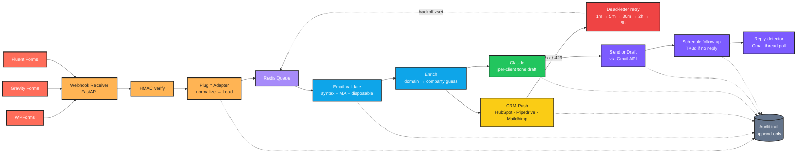

# Universal WordPress Agent

> **One agent platform — WordPress forms → CRM → email — deploy a new client in under an hour.**

[](.github/workflows/ci.yml)
[](https://www.python.org/)
[](https://fastapi.tiangolo.com/)
[](tests/)

---

## What it does

Most Vertex Web Studio clients run WordPress with WPForms, Gravity Forms, or Fluent Forms, connected to a CRM (HubSpot, Pipedrive, or Mailchimp) and Gmail for outbound mail. **Every client wires this up differently — and every client loses leads in the same places.** This platform replaces that patchwork with a single agent that any new client can be onboarded into in under an hour.

A lead lands on a WordPress site → the agent receives a webhook → normalizes the payload regardless of plugin → validates and enriches the email → pushes the contact to the client's CRM (with retries and a dead-letter queue, so a CRM outage **never drops a lead**) → drafts a personalized auto-response in the client's brand voice using Claude → sends or drafts the reply via Gmail → schedules a follow-up 3 days later, suppressed automatically if the lead has replied. Every step is written to an append-only audit trail and surfaced in a per-client admin dashboard.

---

## Workflow diagram



Color key — <span style="color:#FF6D5A">red</span> webhook source · <span style="color:#FFB454">orange</span> adapter · <span style="color:#A78BFA">violet</span> queue · <span style="color:#0EA5E9">cyan</span> enrich · <span style="color:#FACC15">yellow</span> CRM · <span style="color:#22C55E">green</span> AI · <span style="color:#7C5BFF">purple</span> send/schedule · <span style="color:#EF4444">red</span> retry · <span style="color:#64748B">grey</span> audit.

---

## Per-client config

One YAML file per client lives in [`config/clients/`](config/clients/). Drop in, restart, done — no code changes.

```yaml
# config/clients/acme.yaml

# REQUIRED — unique slug; MUST match the filename
client_id: acme

# REQUIRED — root domain of the WordPress site (used as a fallback to resolve
#            webhooks when client_id isn't in the URL)
domain: acme.com

# REQUIRED — which form plugin this client uses on their WP site.
# One of: wpforms | gravity | fluent
form_plugin: wpforms

# REQUIRED — which CRM to push contacts into.
# One of: hubspot | pipedrive | mailchimp
crm: hubspot

# REQUIRED — id of the secret holding the CRM credentials JSON.
# For local dev, set env var ACME_HUBSPOT_JSON='{"access_token":"..."}'.
# For prod, swap src/secrets.py for AWS Secrets Manager / Vault.
crm_credentials_secret_id: acme_hubspot

# REQUIRED — From: address for auto-responses.
sender_email: hello@acme.com

# REQUIRED — drives the Claude system prompt for this client's tone.
tone_profile:
  id: acme_warm
  description: >
    Friendly, helpful, slightly informal. Acme is a small consultancy.
  sample_phrases:
    - "Thanks for getting in touch."
    - "Happy to help with that."
  signature: |
    The Acme team

# OPTIONAL — draft (review first) | send (immediate). Default: draft.
auto_response_policy: send

# OPTIONAL — follow-up sequence. Each step's delay_days is measured from the
# previous step (or from auto_response_sent_at for the first step).
followup_steps:
  - id: acme_nudge
    delay_days: 3
    subject: "Following up — {first_name}"
    body_template: |
      Hi {first_name}, just checking in.
      — The Acme team

# OPTIONAL — simple routing rules, evaluated in order.
routing_rules:
  - when_field: message
    matches: "(?i)(enterprise|RFP)"
    assign_to: founder@acme.com
    tag: enterprise

# OPTIONAL — per-client HMAC secret. Falls back to WEBHOOK_DEFAULT_SECRET.
# webhook_secret: <set in prod>
```

A heavily-commented template lives at [`config/clients/_example.yaml`](config/clients/_example.yaml).

---

## Onboarding a new client in under an hour

1. **Copy the template** — `cp config/clients/_example.yaml config/clients/<client_id>.yaml`. Set `client_id`, `domain`, `form_plugin`, `crm`, `sender_email`, and `tone_profile`.
2. **Provision CRM credentials** — get an API key/token. Set the env var named `<CLIENT_ID>_<crm>_JSON='{"access_token":"..."}'` (e.g. `ACME_HUBSPOT_JSON`). For prod, push to your secret manager and update `src/secrets.py`.
3. **Pick a webhook secret** — either rely on `WEBHOOK_DEFAULT_SECRET` or set `webhook_secret:` in the YAML for per-client isolation.
4. **Authorize Gmail** — run the OAuth flow with the client's mailbox and put the refresh token into `GMAIL_REFRESH_TOKEN` (single-tenant) or your per-client secret.
5. **Configure the WordPress plugin** — point its webhook at `POST https://<your-host>/webhook/<client_id>/<plugin>` and set the HMAC header `X-Webhook-Signature: sha256=<hmac-sha256(body, secret)>`.
6. **Smoke test** — submit the form once. Watch the lead appear at `/admin/<client_id>` and confirm the audit trail shows `webhook_received → validate_email → enrich → crm_push → draft_autoresponse → send_autoresponse`.
7. **Decide reply policy** — flip `auto_response_policy: draft` → `send` once the client has reviewed a few drafts.

---

## Adding a new form plugin

Subclass `FormAdapter` and decorate. New plugin = one file, zero core changes.

```python
# src/adapters/forms/typeform.py
from typing import Any
from ...models import Lead
from .base import FormAdapter, register_form_adapter

@register_form_adapter
class TypeformAdapter(FormAdapter):
    name = "typeform"

    def normalize(self, raw: dict[str, Any], *, client_id: str) -> Lead:
        answers = {a["field"]["ref"]: a.get("text") or a.get("email")
                   for a in raw["form_response"]["answers"]}
        return Lead(
            client_id=client_id,
            source_plugin=self.name,
            email=answers["email"],
            first_name=answers.get("first_name"),
            message=answers.get("message"),
        )
```

Then add it to `src/adapters/forms/__init__.py`:

```python
from . import fluent, gravity, typeform, wpforms  # noqa: F401
```

Webhook URL: `POST /webhook/<client_id>/typeform`. Done.

---

## Adding a new CRM

Same pattern — subclass `CRMAdapter`, `async def push(...)`, register.

```python
# src/adapters/crm/salesforce.py
import httpx
from ...models import ClientConfig, Lead, PushResult
from .base import CRMAdapter, is_retryable_status, register_crm_adapter

@register_crm_adapter
class SalesforceAdapter(CRMAdapter):
    name = "salesforce"

    async def push(self, lead, *, credentials, config) -> PushResult:
        async with httpx.AsyncClient(timeout=15) as client:
            r = await client.post(
                f"{credentials['instance_url']}/services/data/v59.0/sobjects/Lead",
                headers={"Authorization": f"Bearer {credentials['access_token']}"},
                json={"Email": str(lead.email), "FirstName": lead.first_name,
                      "LastName": lead.last_name or "(unknown)", "Company": lead.company or "(unknown)"},
            )
        if r.status_code in (200, 201):
            return PushResult(ok=True, crm=self.name, external_id=r.json()["id"])
        return PushResult(ok=False, crm=self.name,
                          error=f"{r.status_code}: {r.text[:200]}",
                          retryable=is_retryable_status(r.status_code))
```

Then `from . import salesforce` in `src/adapters/crm/__init__.py`. Pick it up in any client YAML by setting `crm: salesforce`.

---

## Failure mode design

| Mechanism | Behavior |
|---|---|
| **Audit trail** | Append-only JSONL (or Redis list) — `audit/{client_id}.jsonl`. Every pipeline step writes BEFORE the side effect. Loss of audit ⇒ abort step. |
| **CRM retry** | `5xx` and `429` are retryable. Re-queued into a Redis sorted set keyed on `now() + backoff`. Backoff: **1m → 5m → 30m → 2h → 8h**. |
| **Dead-letter** | After 5 retries (or non-retryable error) the envelope lands on `queue:dead`, a durable list. Ops alert + manual replay. |
| **Lead always autoresponded** | If the CRM is down, we still send the customer-facing email. Lead never sees the outage. |
| **Idempotent CRM upserts** | Adapters use `PUT` (Mailchimp) or treat `409 already exists` as success (HubSpot). Re-running a retry never creates duplicates. |
| **Config bleed test** | Loader rejects YAML whose internal `client_id` doesn't match its filename — defends against `mv acme.yaml zenith.yaml`. |
| **Fail loud at boot** | Pydantic `ValidationError` on a malformed config raises at first load — never silently mid-flight. |

---

## Tech stack

| Layer | Choice | Why |
|---|---|---|
| Language | Python 3.10+ | Type hints + Pydantic + asyncio |
| Web | FastAPI + uvicorn | Async webhooks, OpenAPI for free |
| Models | Pydantic v2 | One source of truth for `Lead`, `ClientConfig`, `AuditEntry` |
| Queue | Redis (`fakeredis` in tests) | List + sorted set is enough; no Celery/Sidekiq overhead |
| HTTP | httpx | Async, sync, and easy to mock with respx |
| AI | Anthropic Claude (Opus 4.7) | Prompt caching on system prompt = warm calls are cheap |
| Logging | structlog | JSON-structured logs from day one |
| Config | YAML + Pydantic | Human-editable, machine-validated |
| Tests | pytest + fakeredis + httpx mock | Hermetic — zero network in CI |
| Lint | ruff | Fast, opinionated |
| CI | GitHub Actions | Matrix py 3.10/3.11/3.12 + uvicorn smoke test |

---

## Folder structure

```
.
├── src/
│   ├── api/                 # FastAPI app: webhook receiver + admin dashboard
│   │   ├── app.py
│   │   ├── security.py      # HMAC verification
│   │   └── templates/       # Jinja2 dashboard templates
│   ├── adapters/
│   │   ├── forms/           # wpforms, gravity, fluent + base + registry
│   │   └── crm/             # hubspot, pipedrive, mailchimp + base + registry
│   ├── audit/               # append-only JSONL / Redis trail
│   ├── drafter/             # Claude wrapper (per-client tone, prompt cache)
│   ├── enrich/              # email validator + light company-guess
│   ├── queue/               # Redis queue + dead-letter + scheduled retries
│   ├── scheduler/           # follow-up scanner + reply detector
│   ├── sender/              # Gmail send / draft
│   ├── config_loader.py     # per-client YAML loader (isolation enforced)
│   ├── models.py            # Lead, ClientConfig, AuditEntry, PushResult
│   ├── secrets.py           # secret-store shim (env-var local; swappable)
│   ├── settings.py          # env-driven runtime settings
│   ├── logging_setup.py     # structlog
│   └── worker.py            # consumes the queue, runs the pipeline
├── config/clients/          # one YAML per client (acme.yaml, globex.yaml...)
├── tests/                   # pytest suite (34 tests, fully hermetic)
├── .github/workflows/ci.yml # matrix tests + lint + uvicorn smoke
├── .env.example
├── requirements.txt
├── pyproject.toml
├── CLAUDE.md
└── README.md
```

---

## Setup

```bash
git clone <your-fork> && cd 16-universal-wordpress-agent

# 1. Virtualenv
python -m venv .venv
source .venv/Scripts/activate           # Windows
# source .venv/bin/activate             # macOS / Linux

# 2. Deps
pip install -r requirements.txt

# 3. Env
cp .env.example .env                    # then edit ANTHROPIC_API_KEY etc.

# 4. Redis (one of)
docker run -p 6379:6379 -d redis:7-alpine
# or: brew install redis && brew services start redis

# 5. Drop in a client config
cp config/clients/_example.yaml config/clients/acme.yaml
# Edit acme.yaml — set client_id, domain, crm, tone, etc.

# 6. CRM credentials (env-var secret store, local dev)
export ACME_HUBSPOT_JSON='{"access_token":"..."}'
```

---

## Environment variables

| Var | Required | Default | What it does |
|---|---|---|---|
| `CLIENT_CONFIG_DIR` | no | `config/clients` | Where to look for `<client_id>.yaml` |
| `REDIS_URL` | yes | `redis://localhost:6379/0` | Queue + dead-letter + audit index |
| `ANTHROPIC_API_KEY` | yes (for drafter) | — | Claude API key |
| `ANTHROPIC_MODEL` | no | `claude-opus-4-7` | Drafter model |
| `GMAIL_CLIENT_ID` | yes (for sender) | — | OAuth client id |
| `GMAIL_CLIENT_SECRET` | yes (for sender) | — | OAuth client secret |
| `GMAIL_REFRESH_TOKEN` | yes (for sender) | — | Long-lived refresh token |
| `WEBHOOK_DEFAULT_SECRET` | yes | `change-me` | Fallback HMAC secret (per-client overrides in YAML) |
| `LOG_LEVEL` | no | `INFO` | structlog level |
| `EMAIL_CHECK_DELIVERABILITY` | no | `true` | Live MX check on inbound emails (off in tests) |
| `<SECRET_ID>_JSON` | yes (per client) | — | JSON-encoded CRM credentials, looked up by `crm_credentials_secret_id` |

---

## Running locally

Three processes, one terminal each:

```bash
# Terminal 1 — webhook receiver + admin dashboard
uvicorn src.api:app --reload --port 8000

# Terminal 2 — worker (consumes the Redis queue)
python -m src.worker

# Terminal 3 — follow-up scheduler (hourly tick)
python -m src.scheduler                   # daemon
# python -m src.scheduler --once          # one-shot, for cron
```

Then:

* **Health** → http://localhost:8000/health
* **OpenAPI** → http://localhost:8000/docs
* **Admin dashboard** → http://localhost:8000/admin
* **Webhook** → `POST http://localhost:8000/webhook/<client_id>/<plugin>` with `X-Webhook-Signature: sha256=<hex>`

### Submit a test webhook

```bash
BODY='{"form_id":1,"fields":{"name":{"value":"Jane Doe"},"email":{"value":"jane@example.com"},"message":{"value":"Hi"}}}'
SIG=$(echo -n "$BODY" | openssl dgst -sha256 -hmac "$WEBHOOK_DEFAULT_SECRET" | awk '{print $2}')
curl -X POST http://localhost:8000/webhook/acme/wpforms \
  -H "Content-Type: application/json" \
  -H "X-Webhook-Signature: sha256=$SIG" \
  -d "$BODY"
```

### Run the tests

```bash
pytest                                    # 34 tests, ~5s, hermetic
pytest --cov=src                          # with coverage
ruff check src tests                      # lint
```

---

## Deployment

### Single-tenant (one client per deployment)

Simplest. One container per client.

| Component | Run |
|---|---|
| API | `uvicorn src.api:app --host 0.0.0.0 --port 8000 --workers 2` |
| Worker | `python -m src.worker` (1+ replicas) |
| Scheduler | `python -m src.scheduler` (exactly 1 replica) |
| Redis | Managed (Upstash / ElastiCache / Redis Cloud) |

### Multi-tenant (one platform, many clients)

The codebase already supports this — `client_id` is in every URL, queue envelope, and audit row. Make sure:

* `client_config_dir` is shared across replicas (S3-backed volume, or bake into the image).
* `audit/` writes go to a shared store (swap `JsonlAuditTrail` for `RedisAuditTrail` or a DB-backed implementation).
* The scheduler runs in a single instance to avoid double-sending follow-ups (use a leader-election sidecar or a managed cron).

### Container

```dockerfile
FROM python:3.12-slim
WORKDIR /app
COPY requirements.txt .
RUN pip install --no-cache-dir -r requirements.txt
COPY . .
EXPOSE 8000
CMD ["uvicorn", "src.api:app", "--host", "0.0.0.0", "--port", "8000"]
```

---

## Troubleshooting

| Symptom | Cause | Fix |
|---|---|---|
| `401 invalid signature` on every webhook | Plugin signs the URL or path, not the body; or wrong shared secret | Check the plugin docs — we expect `HMAC-SHA256(body, secret)` and accept the `sha256=` prefix. Set `webhook_secret` in the client YAML. |
| `404 unknown client` | URL slug doesn't match a `*.yaml` filename in `CLIENT_CONFIG_DIR` | `ls config/clients/` and confirm the file exists. The YAML's `client_id` must also match. |
| `400 normalize: <plugin> payload has no email field` | Plugin sent unrecognized field keys | Add the key to the relevant `KEYS` list in `src/adapters/forms/base.py`, or wire a new adapter. |
| `crm_push FAILED · 401 unauthorized` | Bad credentials | Re-check the secret env var (`<SECRET_ID>_JSON`). For HubSpot the token must include `crm.objects.contacts.write`. |
| Leads sit in `pending` forever | No worker running | `python -m src.worker`. Health check at `/health` returns queue depths. |
| Follow-ups not firing | Scheduler not running, or `auto_response_thread_id` is null | Start `python -m src.scheduler`. If the sender returned no `thread_id`, reply detection is best-effort skipped. |
| `403` from Gmail | Refresh token revoked or wrong scope | Re-authorize with `https://www.googleapis.com/auth/gmail.modify`. |
| Claude `429` rate-limit | Tier too low or burst from large mailing list import | The drafter is sync from the worker's POV — slow the worker (`--concurrency 1`) or upgrade the Anthropic tier. |
| Dashboard renders empty | Looking at a fresh DB — no leads have been received | Submit a test webhook (see above) and refresh. |

For anything not covered, the `audit/` trail is the source of truth. Every lead has its full step-by-step history at `/admin/<client_id>/leads/<lead_id>`.

---

## License

MIT. Built by Claude for Vertex Web Studio. Portfolio piece — fork, deploy, extend.
